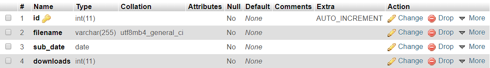

# EndGem
## IMG Winter Assignment

Welcome to EndGem!

I have made a fully functional website for maintaining the course material in various courses(according to the problem statement). The site uses PHP for backend and AJAX for updating the number of downloads and the leaderboard asynchronously.

_Note: This is a responsive website, so you will have a trouble-free experience even if you run on your phone/tablet._

**Instructions:-**

1. If you don't have XAMPP installed, you can download it from here - https://www.apachefriends.org/download.html.
2. After installing XAMPP, clone the repository in the 'htdocs' directory in the xampp folder.
3. Open XAMPP control panel and start Apache and MySQL.
4. Go to the link http://localhost/phpmyadmin/. Create a database by the name "endgemdb".
5. Create four tables, namely "course1", "course2", "course3" and "course4" one at a time according to the structure given in the following image:

6. Go to your browser and go to the link - http://localhost/EndGem/homepage/homepage.html. This is the homepage of the website.
7. To add course material, click on the "+" icon on the top-right corner of the page. You will be taken to the add material page. Here you  can add course material in specific courses. I have preset the courses 1, 2, 3 and 4.
8. You can go to the homepage by clicking the logo. You can select the course using the drop-down menu. You will see the uploaded files there.
9. As one downloads a file, the file is downloaded on the computer and the number of downloads increases by one.
10. The leaderboard also updates spontaneously.

***Created by - Devjit Menghani(18119010)***
